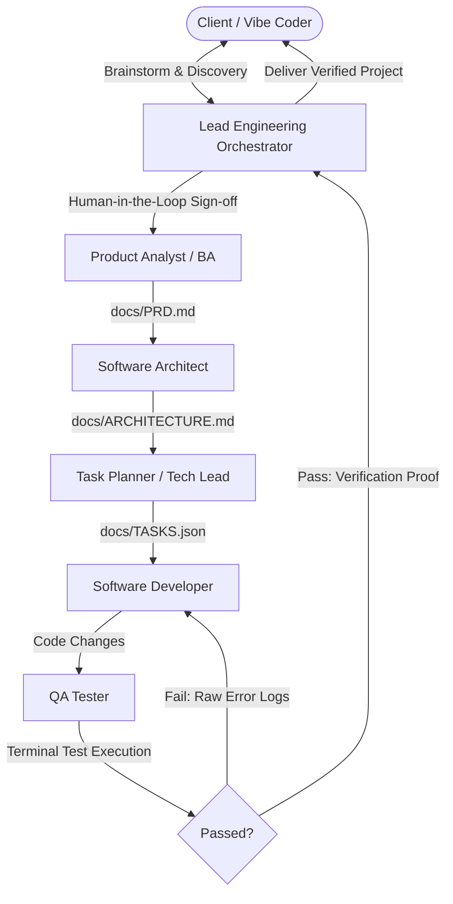

# SoftwareEngineeringAgents

> **An autonomous software engineering organization built for non-technical "vibe coders".**

You don't need to know how to write a PRD, design software architecture, decompose work, write code, or execute test suites. You simply discuss your idea with the **Lead Engineering Orchestrator**, brainstorm the details, approve the scope, and the orchestrator triggers and coordinates a specialized team to build and verify your software.

---

## Organizational Structure

Modeled after project delivery teams in modern IT services and tech MNCs:



1. **Lead Engineering Orchestrator**: Client engagement lead. Clarifies ambiguities, formulates the scope, and enforces the approval gate.
2. **Product Analyst**: Synthesizes discussions into a formal `docs/PRD.md` with user stories and acceptance criteria.
3. **Software Architect**: Produces `docs/ARCHITECTURE.md` specifying data schemas, API contracts, and directory layouts.
4. **Task Planner**: Decomposes the architecture into an ordered, executable DAG in `docs/TASKS.json`.
5. **Software Developer & QA Tester (Evaluator-Optimizer Loop)**: Developers implement code; QA automates and runs real tests in the terminal. No code is declared complete without a passing exit code.

---

## Universal Compatibility

This repository is designed to run seamlessly across all major AI developer tools:

### 1. Antigravity CLI (`agy`) and Antigravity IDE
- **Discovery**: Automatically discovers `.agents/rules/` and `.agents/skills/`.
- **Usage**: Run `agy` in this repository or open the folder in Antigravity IDE. The Lead Orchestrator persona will automatically govern the conversation.

### 2. Claude Code CLI
- **Discovery**: Automatically reads `CLAUDE.md` at the repository root.
- **Usage**: Run `claude` in this repository. Claude Code adopts the Orchestrator protocol, pauses for your approval, and executes the team pipeline.

### 3. Standalone Terminal Engine
- **Usage**: Run the interactive Python engine in any terminal:
  ```bash
  python -m engine.cli
  ```

---

## Sticky Model Detection & Selection

AI platforms remember your model preference across sessions. This engine mirrors that behavior:

1. **Sticky Session Cache**: Remembers your latest model choice in `.orchestrator/config.json`.
2. **Environment Variable Detection**: Respects `GEMINI_MODEL`, `ANTHROPIC_MODEL`, or `OPENAI_MODEL` if configured.
3. **Interactive Confirmation**: On startup, the engine displays:
   ```text
   [Orchestrator] Detected default model: gemini-2.5-pro (gemini)
                  (Retrieved from your previous session / environment settings)

   Press [Enter] to confirm and continue with this model,
   or type 'change' to customize models:
   ```
4. **Manual Override**: Typing `change` allows switching the global model or assigning specialized models to specific agents (e.g. Gemini 2.5 Pro for Architecture, Claude 3.7 Sonnet for Coding).

---

## Directory Structure

```text
SoftwareEngineeringAgents/
├── .agents/
│   ├── rules/
│   │   ├── orchestrator-governance.md   # Approval gates & client-engagement rules
│   │   └── qa-verification.md           # Real terminal test execution requirements
│   └── skills/
│       ├── product-analyst/SKILL.md     # Elicits user requirements -> PRD.md
│       ├── software-architect/SKILL.md  # PRD -> ARCHITECTURE.md & schema
│       ├── task-planner/SKILL.md        # ARCHITECTURE -> tasks.json DAG
│       ├── software-developer/SKILL.md  # tasks.json -> code implementation
│       └── qa-tester/SKILL.md           # test generation & terminal execution
├── engine/                              # Standalone Python runner
│   ├── cli.py                           # Interactive CLI entrypoint
│   ├── config.py                        # Sticky model detection & cache
│   ├── state.py                         # Dataclasses & stage tracking
│   ├── orchestrator.py                  # Multi-agent coordinator & FSM
│   └── tools/
│       ├── workspace.py                 # File read/write tools
│       └── terminal.py                  # Real test runner
├── AGENTS.md                            # Universal agent guidelines
├── GEMINI.md                            # Antigravity workspace rules
├── CLAUDE.md                            # Claude Code CLI universal entrypoint
├── requirements.txt
└── README.md
```
